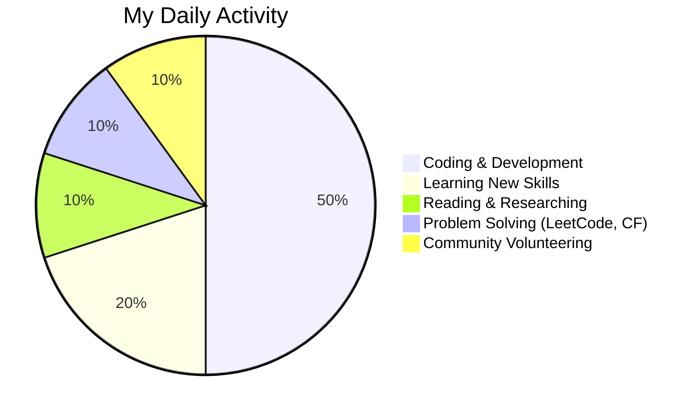

<h1 align="center">Hi 👋, I'm Segni Girma</h1>
<h3 align="center">🚀 A Passionate Data Scientist | Python • SQL • Machine Learning • Data Visualization</h3>

 
  
  

---

### 🔥 **About Me**

- 🎓 **Student** at **Adama Science and Technology University**  
- 👨‍💻 Passionate about **Data Science, Machine Learning**, and **AI**  
- 🌟 Love working on **Data Analysis, Backend Development**, and **Visualization**  
- 💡 Exploring **TensorFlow, Scikit-Learn, and Deep Learning**  
- 🎯 Focused on solving real-world challenges with data-driven solutions  
- 🌐 Active in open-source communities and coding platforms  
- 🤝 Available for **collaborations** on Data Science and ML projects  

---

### 🚀 **Connect With Me**  

  
  
  
  
  
  

---

### 🛠️ **Languages and Tools**  

  

---

### 📊 **GitHub Stats**

  
  

  
  

---

### 💻 **Projects I've Worked On**  

| Project Name 🚀         | Description 📄                                       | Tech Stack 💻                      | Link 🔗                                     |
|-------------------------|-----------------------------------------------------|-----------------------------------|--------------------------------------------|
| **E2Exam Bot**          | Telegram bot for file organization and exam prep    | Python, Telebot, PostgreSQL       | [E2Exam Repository](https://github.com/segni/E2Exam)  |
| **Retail Data Analysis**| Analyzed retail datasets for insights and trends    | Python, Pandas, Power BI          | [View Project](https://github.com/segni/retail-analysis) |
| **Data Cleaning Tool**  | Automated script for data cleaning and wrangling    | Python, Pandas, SQL               | [Check it Out](https://github.com/segni/data-cleaner) |

---

### 🏆 **Achievements**

- 🏅 **Data Science Mentor** at **Computer Science and Engineering Club (CSEC)**  
- 📈 Solved over **500+ problems** across **LeetCode, Codeforces**, and **HackerRank**  
- 🛠️ Built impactful projects with **Python, SQL**, and **Data Visualization Tools**  
- 🌍 Contributed to open-source projects and community tutorials  

---

### 🌟 **Fun Facts About Me**  

- 🎵 I enjoy listening to **Oromo Music** and reading about Data Trends  
- 🌐 I love solving **real-world problems** using **data insights**  
- 💬 Talk to me about **Data Science, Problem Solving**, and **Tech Communities**  

---

### 🎯 **My Daily Routine**  

---

### 🌱 **Let's Collaborate!**

- 🤝 Open for collaborations on **Data Science Projects**  
- 💼 Available for freelancing or mentorship opportunities  
- 📬 Reach me via LinkedIn or email: **validresult11@gmail.com**  

---

  

