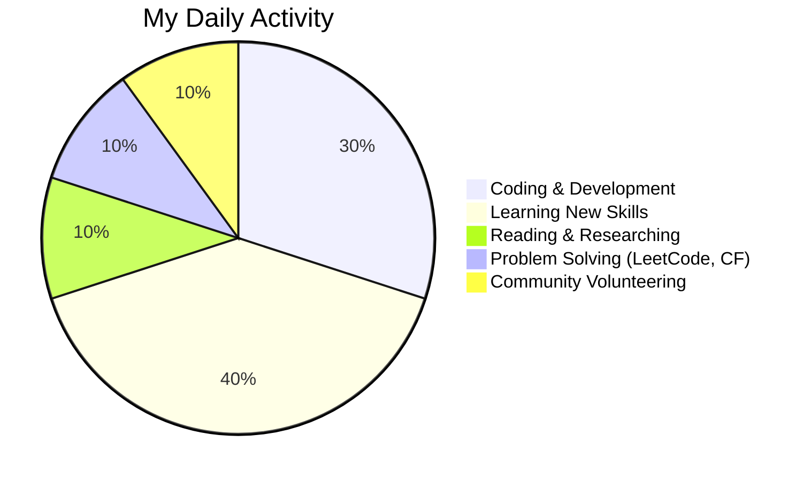

<h1 align="center">Hi 👋, I'm Segni Girma</h1>
<h3 align="center">🚀 A Passionate Data Scientist | Python • SQL • Machine Learning • Data Visualization</h3>

<p align="center"> 
  
  <a href="https://github.com/segnig?tab=followers">
    
  </a>
</p>

---

### 🔥 **About Me**

- 🎓 **Student** at **Adama Science and Technology University**  
- 👨‍💻 Passionate about **Data Science, Machine Learning**, and **AI**  
- 🌟 Love working on **Data Analysis, Backend Development**, and **Visualization**  
- 💡 Exploring **TensorFlow, Scikit-Learn, and Deep Learning**  
- 🎯 Focused on solving real-world challenges with data-driven solutions  
- 🌐 Active in open-source communities and coding platforms  
- 🤝 Available for **collaborations** on Data Science and ML projects  

---

### 🚀 **Connect With Me**

<p align="center">
  <a href="https://linkedin.com/in/validresult11" target="_blank">
    
  </a>
  <a href="https://stackoverflow.com/users/22329107/segni-girma" target="_blank">
    
  </a>
  <a href="https://kaggle.com/valid_result" target="_blank">
    
  </a>
  <a href="https://zindi.africa/users/valid_result" target="_blank">
    
  </a>
  <a href="https://codeforces.com/profile/valid_result" target="_blank">
    
  </a>
  <a href="https://www.leetcode.com/valid_result" target="_blank">
    
  </a>
  <a href="https://t.me/valid_result" target="_blank">
    
  </a>
  <a href="https://www.instagram.com/valid_result" target="_blank">
    
  </a>
  <a href="https://discord.gg/valid_result" target="_blank">
    
  </a>
</p>

---

### 🛠️ **Languages and Tools**

<p align="center">
  
</p>

---

### 📊 **GitHub Stats**

<p align="center">
  
</p>

<div align="center">
  
  
</div>

<div align="center">
  
</div>


---

### 💻 **Projects I've Worked On**

| Project Name 🚀         | Description 📄                                       | Tech Stack 💻                      | Link 🔗                                     |
|-------------------------|-----------------------------------------------------|-----------------------------------|--------------------------------------------|
| **E2Exam Bot**          | Telegram bot for file organization and exam prep    | Python, Telebot, PostgreSQL       | [E2Exam Repository](https://github.com/segnig/E2Exam-Telegram-bot)  |
| **Titanic Kaggle Competition** | Data Science Kaggle competition for prediction | Python, Pandas, Feature Engineering, EDA | [Titanic](https://github.com/segnig/kaggle/Titanic) |
| **Tanzania Tourism Prediction** | Zindi Competition for tourism prediction | Python, Pandas, ML Models, EDA    | [Tanzania Tourism](https://github.com/segnig/Tanzania-Tourism-Prediction) |
| **Financial Inclusion Africa** | Predicting financial inclusion in Africa      | Python, Scikit-Learn, Data Analysis | [Financial Inclusion](https://github.com/segnig/Financial-Inclusion-in-Africa)|

---

### 🏆 **Achievements**

- 🏅 **Data Science Mentor** at **Computer Science and Engineering Club (CSEC)**  
- 📈 Solved over **700+ problems** across **LeetCode, Codeforces**, and **HackerRank**  
- 🛠️ Built impactful projects with **Python, SQL**, and **Data Visualization Tools**  

---

### 🌟 **Fun Facts About Me**

- 🎵 I enjoy listening to **Music** and exploring Data Trends.  
- 🌐 I love solving **real-world problems** using **data insights**.  
- 💬 Talk to me about **Data Science, Problem Solving**, and **Tech Communities**.  
- 🕵️‍♂️ I enjoy **solving puzzles** and **algorithmic challenges**.

---

### 🎯 **My Daily Routine**



---

### 🌱 **Let's Collaborate!**

- 🤝 Open for collaborations on **Data Science Projects**  
- 💼 Available for freelancing or mentorship opportunities  
- 📬 Reach me via LinkedIn or email: **segnigirma11@gmail.com**  

---

### 🏆 **Other Notable Mentions**

- **Top 10% Kaggle Contributor** in competitions such as **Titanic** and **House Prices**.  
- Regular contributor to the **StackOverflow** community, answering **Data Science** and **Machine Learning** questions.  
- Active **LeetCode** user with a focus on **Data Structures and Algorithms**.

---

### 💡 **Inspirations**

- 📚 **Books I recommend** for aspiring Data Scientists:  
    - **"Hands-On Machine Learning with Scikit-Learn, Keras, and TensorFlow"**  
    - **"Python for Data Analysis"**  
    - **"Deep Learning with Python"**

- 🎥 **YouTube Channels I Follow** for Data Science:  
    - **Data School**  
    - **StatQuest with Josh Starmer**  
    - **Sentdex**

---

<p align="center">
  
</p>

```
